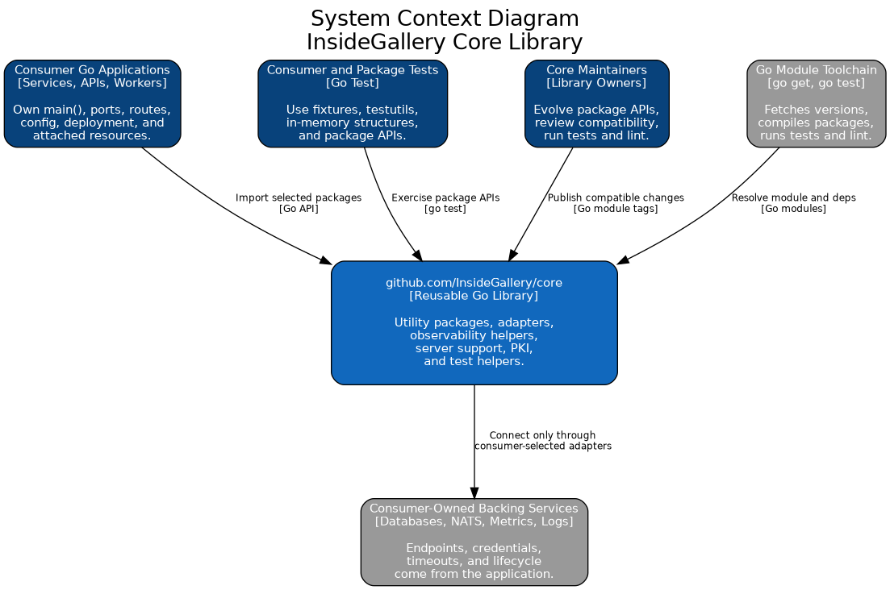
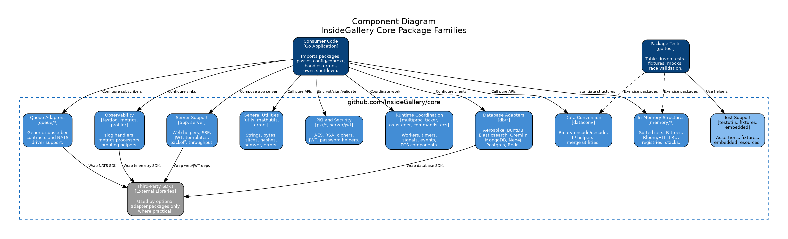

# Arc42: InsideGallery Core Library

This document is the current-state Arc42 architecture description for
`github.com/InsideGallery/core`.

`core` is a reusable Go module imported by InsideGallery applications. It is a
library, not an executable system: there is no `main()`, no `cmd/`, no owned
network port, and no repository-owned deployment topology. Consuming
applications decide which packages to import, how to wire them, which backing
services to attach, and how to deploy the resulting process.

## 1. Introduction and Goals

### 1.1 Requirements Overview

The architecturally significant requirements are:

| ID | Requirement |
|----|-------------|
| R1 | Publish reusable Go packages under the module path `github.com/InsideGallery/core` for use through normal Go module dependency management. |
| R2 | Keep package APIs independently usable so consumers can import only the utilities, adapters, or runtime helpers they need. |
| R3 | Provide pure utility and domain-support packages for conversion, math, in-memory structures, ECS, commands, errors, PKI, timers, and general helpers. |
| R4 | Provide optional adapter packages for databases, queues, metrics, logging, and web/server support without forcing one application topology. |
| R5 | Keep consumer applications responsible for process lifecycle, routing, port binding, dependency injection, deployment, and environment-specific configuration. |
| R6 | Preserve backward compatibility for exported APIs; breaking changes require explicit versioning or additive replacement paths. |
| R7 | Keep third-party SDKs at package boundaries where practical, with core-owned wrappers preferred for new public contracts. |
| R8 | Keep the module buildable, testable, lintable, and race-checkable as one library repository. |

### 1.2 Quality Goals

| Priority | Quality Goal | Scenario |
|----------|--------------|----------|
| 1 | API stability | A consumer can upgrade a compatible `core` version without changing unrelated application code. |
| 2 | Maintainability | Package boundaries are clear enough that a change in one package does not force edits across unrelated packages. |
| 3 | Performance efficiency | Hot-path helpers and data structures avoid unnecessary allocations and reflection where simple Go code is sufficient. |
| 4 | Testability | Pure packages run with normal unit tests; integration-heavy adapters can be tested behind explicit setup or build tags. |
| 5 | Operational fit | Runtime helpers follow Twelve-Factor expectations by leaving config, ports, processes, and attached resources under the consumer application's control. |

### 1.3 Stakeholders

| Stakeholder | Expectations |
|-------------|--------------|
| Consumer application teams | Small, stable importable packages for common infrastructure and utility needs. |
| Service maintainers | Backward-compatible APIs, clear package ownership, and predictable verification commands. |
| Platform and SRE teams | Helpers that support environment-driven config, structured logs, metrics, graceful shutdown, and replaceable backing services. |
| Security reviewers | Cryptography, JWT, password, and adapter code with explicit errors and no hidden credentials or fixed runtime endpoints. |
| Test authors | Shared fixtures and assertions that reduce duplicate setup without hiding failures. |
| Future agents and reviewers | Architecture evidence that reflects this repository's actual boundary as a Go library. |

## 2. Architecture Constraints

| Constraint | Effect |
|------------|--------|
| Go module `github.com/InsideGallery/core` | Public API is the set of exported packages and symbols reachable through Go imports. |
| Go version from `go.mod` | The repository currently declares Go `1.26.1`; tooling and docs should follow the module file. |
| Library, not application | No `main()`, no `cmd/`, no process manager, no owned listener, no fixed port, no Docker/Kubernetes contract in this repository. |
| Consumer-owned composition | Applications decide which packages to instantiate and how to inject configs, loggers, clients, and contexts. |
| Public package compatibility | Exported symbols are compatibility commitments unless replaced through an additive path before deprecation. |
| Optional infrastructure packages | Packages under `db/`, `metrics/`, `fastlog/`, `app/`, and `server/` are helpers and adapters, not a deployed platform. |
| Third-party dependency wrapping | New contracts should prefer core-owned types and interfaces over leaking vendor SDK types through public APIs. |
| Environment-driven runtime config | Packages may help parse or hold config, but deploy-specific values and secrets belong to the consuming application environment. |
| Strict local verification | Changes are expected to run `go test ./...`, `go test -race -count=1 ./...`, and `golangci-lint run ./...`. |

## 3. Context and Scope

### 3.1 Business Context

| External actor/system | Interaction with `core` |
|-----------------------|--------------------------|
| InsideGallery Go services | Import selected packages for shared utilities, clients, middleware, metrics, logging, PKI, and server support. |
| Test suites | Reuse `fixtures/`, `github.com/FrogoAI/testutils`, and in-memory packages to keep tests repeatable. |
| Backing services | Are contacted only when a consumer chooses an adapter package such as Aerospike, MongoDB, Postgres, Redis, NATS, or metrics exporters. |
| Observability stacks | Receive logs or metrics through consumer-configured `fastlog/` and `metrics/` packages. |
| Maintainers | Evolve shared APIs while preserving compatibility and keeping drift out of architecture docs. |

Source: [images/c4_context.dot](images/c4_context.dot)

### 3.2 Technical Context

| Interface | Technology | Port / Location | Notes |
|-----------|------------|-----------------|-------|
| Library import | Go modules | `github.com/InsideGallery/core/...` | Consumers import packages directly; this repository does not expose a network service. |
| Configuration | Structs and environment parsing where package-specific helpers exist | Consumer process | Secrets, URLs, credentials, and bind addresses are supplied by the application. |
| Database adapters | Aerospike, BuntDB, Elasticsearch, FrogoDB, Gremlin, MongoDB, Neo4j, Postgres, Redis | Consumer-provided endpoints | Adapters wrap client setup and common operations. |
| Queue worker bootstrap | `github.com/FrogoAI/mq-balancer` | Consumer-provided endpoints | Consumers own subjects, connection lifecycle, and process behavior. |
| Server support | Fiber/webserver, JWT, SSE, templates, backoff, throughput helpers | Consumer-owned ports/routes | `core` supplies helpers; the application binds ports and routes. |
| Observability | `log/slog`, Datadog, Prometheus, OpenTelemetry, StatsD-related packages | Consumer-owned exporters/backends | No repository-owned dashboard or metrics endpoint contract. |
| Pure helpers | Standard Go APIs plus local packages | In-process calls | Conversion, math, memory structures, crypto, strings, slices, and related utilities. |

### 3.3 Repository Boundary

This repository contains:

- reusable Go packages under the module path `github.com/InsideGallery/core`
- package-local tests, fixtures, and shared test helpers
- AICS architecture documentation for the library boundary
- the public `README.md` with install/import usage, package catalog,
  configuration paths, verification commands, and compatibility policy
- source policy/reference documents used by agents and reviewers

It intentionally excludes:

- executable application entrypoints
- consumer-specific dependency-injection wiring
- application routes, NATS subject ownership, or public API specifications
- fixed ports, process formation, Docker Compose, Kubernetes manifests, and production deployment definitions
- credentials, hostnames, and environment-specific configuration

## 4. Solution Strategy

| Concern | Strategy |
|---------|----------|
| Public reuse | Keep packages importable through Go modules with stable exported APIs and package-local documentation. |
| Modularity | Treat each top-level or focused sub-package as the replaceable library unit; unrelated packages should not require each other. |
| Consumer control | Expose constructors, configs, interfaces, and helpers; leave lifecycle and composition to the consuming application. |
| Infrastructure isolation | Keep database, queue, web, logging, and metrics integrations in adapter/support packages rather than pure domain utility packages. |
| Performance | Prefer simple data shapes, explicit error paths, allocation-aware utilities, and focused data structures. |
| Compatibility | Add focused replacement packages before deprecating old names; avoid renaming or removing exported symbols in compatible releases. |
| Verification | Use package tests, race detection, and `golangci-lint` as the repository-wide quality gates. |
| Documentation | Keep `README.md`, Arc42, TSC, and diagrams aligned with the Go library boundary, not with any consuming service; keep API-specific migration guidance in package docs. |

## 5. Building Block View

### 5.1 Level 1: Library Package Families

| Building block | Location | Responsibility |
|----------------|----------|----------------|
| Core utilities | `dataconv/`, `errors/`, `mathutils/`, legacy `utils/` | Binary conversion, IP/string/slice/hash helpers, semantic versioning, random/math helpers, and error utilities. |
| In-memory structures | `memory/` | Bloom filters, B-trees, HLL, linked lists, LRU, ordered maps, registries, sets, sorted sets, stacks, fuzzy search, safe containers, and ordering helpers. |
| Security and PKI | `pki/cryptor/`, `pki/aesgcm/`, `pki/rsaoaep/`, legacy `pki/`, `server/jwt/` | AES/RSA helpers, cipher abstractions, JWT support, password helpers, and related cryptographic utilities. |
| Runtime coordination | `multiproc/`, `oslistener/`, `ticker/`, `commands/`, `ecs/`, `antibot/` | Worker pools, retryable once execution, signal listening, timers, command/event helpers, ECS primitives, and proof-of-work utilities. |
| Data and service adapters | `db/` | Optional clients selected by a consumer application. Queue worker balancing is delegated to `github.com/FrogoAI/mq-balancer` through `app.NATSMain`. |
| Observability | `fastlog/`, `metrics/`, `profiler/` | Structured logging handlers/middleware, metrics clients/processors, and profiling helpers. |
| Server support | `app/`, `server/` | Web, JWT, SSE, view/template, backoff, throughput, instance, honeypot, and profiler support for applications that choose to use them. |
| Test support | `fixtures/` plus `github.com/FrogoAI/testutils` | Shared assertions and service fixtures. |

Source: [images/c4_container.dot](images/c4_container.dot)

### 5.2 Level 2: Important Components

| Component | Main responsibilities | Boundary rule |
|-----------|-----------------------|---------------|
| Pure helpers | Stateless conversion, math, bytes, strings, hashes, and collection utilities. | Should stay independent of infrastructure SDKs and process lifecycle. |
| Memory packages | Reusable in-process data structures and probabilistic structures. | Must not assume persistence or distributed ownership. |
| PKI and security helpers | Encryption, signing, JWT, ciphers, and password support. | Must return errors to callers; consumers own key storage and rotation policy. |
| Database adapters | Client setup/configuration helpers for supported databases. | Consumers own endpoints, credentials, lifecycle, migrations, and operational SLAs. |
| Queue worker bootstrap | `app.NATSMain` wiring to `github.com/FrogoAI/mq-balancer`. | Consumers own subjects, retries, idempotency, and worker process formation. |
| Server helpers | Middleware, templates, SSE, JWT, webserver and app bootstrap helpers. | Consumers own routes, ports, TLS, auth policy, and graceful shutdown semantics. |
| Observability helpers | `slog` handlers, metrics processors, and profiler support. | Consumers own destinations, sampling, dashboards, and alert rules. |

Source: [images/aic01_c4_component.dot](images/aic01_c4_component.dot)

## 6. Runtime View

`core` has no standalone runtime. The only runtime scenarios are consumer-owned
flows that call into imported packages.

### 6.1 Import and Composition

1. A consumer adds the module with `go get github.com/InsideGallery/core`.
2. The consumer imports only the required package paths.
3. The consumer builds configuration from environment variables or struct literals.
4. The consumer constructs clients, helpers, data structures, or middleware.
5. Calls are made through normal Go APIs, usually with `context.Context` when work can block.
6. The consumer handles returned errors, closes resources, and decides logging/metrics behavior.

### 6.2 Pure Utility Use

1. The consumer calls a pure helper or in-memory structure.
2. The package validates input and returns a value or error.
3. No network, filesystem, deployment config, or application lifecycle is implied.

### 6.3 Adapter Use

1. The consumer selects an adapter package such as `db/frogodb`, `db/postgres`, `db/redis`, `metrics`, or `fastlog`, or uses `app.NATSMain` for `mq-balancer` subscriber workers.
2. The consumer supplies endpoint, credential, timeout, and runtime settings from its own environment/config layer.
3. The package creates or wraps a third-party client where supported.
4. The consumer owns context cancellation, retries, transactions, shutdown, and observability policy.

### 6.4 Server-Support Use

1. The consumer imports `app/` or `server/` helpers when building an application.
2. The consumer owns the process entrypoint, address/port binding, routes, TLS, auth policy, and graceful shutdown.
3. `core` helpers participate as library calls or middleware; they do not create a repository-defined service.

Source: [images/aic01_request_pipeline.dot](images/aic01_request_pipeline.dot)

## 7. Deployment View

### 7.1 Deployment Targets

| Target | Mechanism |
|--------|-----------|
| Library release | Go module versions and tags. |
| Local development | `go test`, `go test -race`, `golangci-lint`, and package benchmarks. |
| Consumer applications | The consuming repository decides executable build, container image, process formation, ports, and deployment platform. |

### 7.2 Runtime Topology

There is no `core` node. At runtime, `core` code is compiled into a consumer
application binary or test binary. Any listener, worker, queue consumer,
database connection, metrics exporter, or shutdown hook belongs to that consumer
process.

### 7.3 Configuration Model

Configuration is package-specific and consumer-owned:

| Group | Examples |
|-------|----------|
| Backing services | Database, Redis, Aerospike, MongoDB, Elasticsearch, Neo4j, Gremlin, and NATS connection settings. |
| Server support | Bind addresses, routes, TLS, JWT keys, templates, timeouts, SSE settings, and middleware choices. |
| Observability | Log handler selection, metrics processor settings, profiler enablement, and export destinations. |
| Security | Keys, key files, JWT secrets, cipher selection, password policy, and rotation are supplied by the consumer. |
| Tests | Struct literals, fixtures, mocks, and build tags keep unit and integration concerns separate. |

## 8. Cross-Cutting Concepts

### 8.1 Public API and Compatibility

Every exported package path, type, function, method, constant, and variable can
be used by downstream projects. Compatible changes should be additive. When a
replacement API is needed, keep the old API as a deprecated shim until a
versioned breaking change is deliberately planned.

### 8.2 Dependency Direction

Pure utility packages should not import infrastructure packages. Adapter packages
may import vendor SDKs, but those dependencies should be kept local to the
adapter where possible. New consumer-facing contracts should use core-owned
types and small interfaces so applications are not forced to depend on vendor
types unnecessarily.

CORE-API-01 adds that boundary shape across database, queue, metrics, logging,
webserver, JWT, app bootstrap, error, and cipher packages. Legacy SDK-shaped
exports remain available for compatibility; new consumers should depend on the
core-owned option, result, and error wrapper types.

CORE-API-02 completes the same additive boundary pattern for remaining helper
surfaces: Gremlin edge/traversal helpers, Aerospike entity and HLL helpers,
MongoDB filter/sort helpers, Postgres construction options, and Fiber route
initialization and middleware callbacks. Queue subscriber contracts moved to
`github.com/FrogoAI/mq-balancer`. Legacy
SDK-shaped helper APIs remain available as compatibility shims.

CORE-STATE-01 adds explicit runtime-state ownership for the remaining legacy
defaults: command event managers, ECS entity ID factories, signal listeners,
profiler health/probe state, metrics processor registries and scoped defaults,
database client stores, mq-balancer connection construction, fastlog
logger and handler constructors, Gremlin syntax state, and template directory
configuration.
Package-level `Default`, `Set`, `Get`, and env-reading helpers remain only as
deprecated compatibility shims.

CORE-APP-01 keeps `app.WebMain` and `app.NATSMain` as the simple main-style
bootstrap helpers. They initialize logging, metrics, profiler probes, shutdown
signals, and web routes or NATS subscriptions directly.

### 8.3 Configuration and Twelve-Factor Fit

The library can provide config structs and env parsing helpers, but it must not
hardcode credentials, hostnames, ports, or deployment-specific values. Attached
resources remain attached to the consumer application, not to `core` itself.

### 8.4 Error Handling

Library code returns errors to the caller. Package-level sentinel errors are
valid at public boundaries when callers need `errors.Is`. Error strings stay
lowercase and are wrapped with context where useful.

### 8.5 Concurrency and Lifecycle

Packages that start goroutines, wait on I/O, or coordinate workers should expose
context-aware APIs or explicit close/shutdown paths. Consumers own the process
lifetime and must be able to stop all work cleanly.

### 8.6 Observability

`fastlog/`, `metrics/`, and `profiler/` provide reusable instrumentation
building blocks. They do not define a universal metric namespace, dashboard, or
alerting contract for all consuming applications.

### 8.7 Security

Cryptographic helpers should be explicit about inputs, key sizes, algorithms,
and errors. Secret storage, key rotation, TLS policy, auth policy, and audit
requirements belong to the consuming application.

### 8.8 Testing and Verification

The repository-wide verification contract is:

- `go test ./...`
- `go test -race -count=1 ./...`
- `golangci-lint run ./...`

Unit tests should be table-driven. Tests that require external backing services
should be explicit about prerequisites or build tags so the default lane remains
repeatable.

## 9. Architecture Decisions

| ADR | Decision | Rationale | Consequence |
|-----|----------|-----------|-------------|
| ADR-001 | Maintain `core` as a reusable Go library. | Shared infrastructure and utility code should be consumed through Go modules, not copied between applications. | Consumers own composition, deployment, and runtime configuration. |
| ADR-002 | Keep no application entrypoint in this repository. | A library should be importable and testable without defining a process. | There are no repository-owned ports, routes, or Kubernetes resources. |
| ADR-003 | Treat package paths as public API boundaries. | Go consumers import packages directly; package moves are breaking changes. | Renames and removals require compatibility planning. |
| ADR-004 | Keep infrastructure helpers optional. | Not every consumer needs every backing service, queue, logger, or web helper. | Adapter packages may carry dependencies that pure packages should avoid importing. |
| ADR-005 | Prefer core-owned contracts for new APIs. | Wrapping third-party SDKs reduces downstream coupling. | CORE-API-01 adds replacement option/result contracts while legacy APIs remain compatibility shims. |
| ADR-006 | Leave ports and process lifecycle to consumers. | Twelve-Factor concerns apply to deployable applications, not to this library as a standalone process. | Server-support packages expose error-returning helpers and compatibility shims, not an owned server. |
| ADR-007 | Use repository-wide tests, race checks, and linting as gates. | Shared libraries can break many consumers; broad verification catches cross-package regressions. | Long-running or integration-heavy tests must be managed so the default lane stays useful. |

## 10. Quality Requirements

### 10.1 Quality Overview

| Category | Requirement |
|----------|-------------|
| API stability | Compatible releases do not remove or rename exported APIs without an additive migration path. |
| Maintainability | Packages have clear responsibilities and avoid unrelated imports. |
| Performance | Hot helpers and data structures avoid avoidable allocation and reflection overhead. |
| Reliability | Adapters return errors, honor contexts where applicable, and do not hide critical failures. |
| Security | Secrets and deploy-specific credentials are never fixed in the library. |
| Testability | Default package tests run without requiring all optional external services. |

### 10.2 Concrete Scenarios

| ID | Scenario | Target / Acceptance |
|----|----------|---------------------|
| QS-1 | A service imports only `memory/sortedset`. | The import does not require web, queue, or database setup. |
| QS-2 | A consumer upgrades a patch/minor version. | Existing exported API use keeps compiling unless a documented major-version break is being made. |
| QS-3 | A package connects to a backing service. | Endpoint, credential, timeout, and lifecycle settings come from the consumer. |
| QS-4 | A consumer uses server helpers. | The consumer still owns route registration, port binding, TLS, auth, and shutdown. |
| QS-5 | A long-running operation is cancelled. | Context-aware code returns promptly with an error the caller can handle. |
| QS-6 | A doc or diagram is reviewed by MDCA/CTO stakeholders. | It describes this repository as a library and does not claim another system's server boundary. |

## 11. Risks and Technical Debt

| Risk / Debt | Impact | Mitigation / Current Position |
|-------------|--------|-------------------------------|
| Legacy APIs may expose vendor types | Downstream consumers can become coupled to third-party SDKs. | Core-owned wrappers now cover the primary database, queue, metrics, logging, webserver, JWT, app, error, and cipher boundaries; keep new work on those contracts. |
| Broad dependency set | Consumers may pull dependencies they do not need if imports are not isolated. | Keep optional adapters in focused packages and avoid importing them from pure packages. |
| Hidden runtime state in helpers | Tests and consumers can become order-dependent. | Explicit event managers, entity factories, signal listeners, profiler states, registries, stores, constructors, and close handles now cover the legacy defaults; keep new code on those APIs and leave package-level wrappers for compatibility only. |
| Documentation gaps | Consumers may not know which package to import or how compatibility is handled. | Maintain `README.md` as the public install guide, package catalog, configuration reference, and compatibility policy, with package docs carrying detailed migration examples. |
| External-service tests | Local verification may fail when tests assume services are present. | Gate true integration tests and keep unit tests repeatable. |
| Package names are existing compatibility contracts | Renaming awkward legacy packages would break consumers. | Preserve names unless a major-version migration is deliberately planned. |

## 12. Glossary and Maintained References

### 12.1 Glossary

| Term | Meaning |
|------|---------|
| Adapter package | A package that wraps a database, queue, web, metrics, logging, or other infrastructure dependency. |
| AICS | Architecture and initiative compliance documents under `docs/aics/`. |
| Consumer application | A separate Go service or app that imports `github.com/InsideGallery/core`. |
| Core-owned contract | A public type or interface defined by this module rather than by a vendor SDK. |
| MDCA | Modular Domain-Centric Architecture. |
| Pure package | A package whose behavior is local/in-process and does not require external services. |
| Runtime helper | Library code that helps an application manage workers, servers, signals, metrics, logging, or profiling without owning the process. |

### 12.2 Maintained References

| Need | Maintained document |
|------|---------------------|
| Consumer install and package catalog | `README.md` |
| Architecture | `docs/aics/arc42.md`, `docs/aics/tsc.md` |
| Go library rules | `docs/source/Go Library.md` |
| Engineering principles | `docs/source/Engineering Principles.md` |
| Twelve-Factor guidance | `docs/source/Twelve-Factor App.md` |
| MDCA guidance | `docs/source/mdca.md`, `docs/source/mdca_standard.md` |
| Trunk and verification guidance | `docs/source/tbd.md` |
