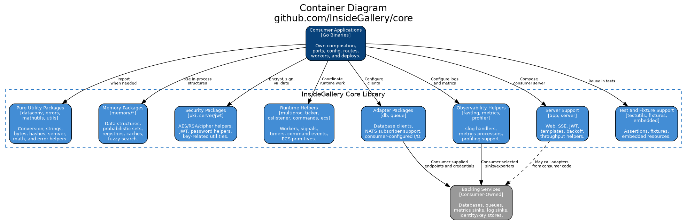
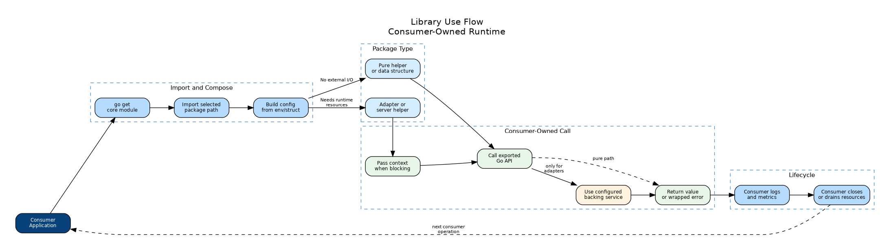

# Tech Stack Canvas: InsideGallery Core Library

This canvas is the current-state technology summary for
`github.com/InsideGallery/core`. It describes the repository as a reusable Go
library. It does not describe a standalone server, product runtime, or
repository-owned deployment.

## Business

### Business Feature Description

| Objective | Description |
|-----------|-------------|
| Reuse shared Go infrastructure | Provide common packages that InsideGallery services can import instead of reimplementing utilities, adapters, logging, metrics, web helpers, queue clients, and security helpers. |
| Keep applications in control | Consumer repositories own process entrypoints, routes, ports, credentials, deployment, and runtime policy. `core` supplies library building blocks only. |
| Improve consistency | Shared packages make common behavior testable and reviewable in one place while preserving package-level independence. |

### System Name and Description

| Item | Value |
|------|-------|
| System | InsideGallery Core Library |
| Repository | `github.com/InsideGallery/core` |
| Purpose | Reusable Go module containing utility packages, in-memory data structures, adapters, observability helpers, PKI/security helpers, server-support helpers, and test helpers. |
| Runtime scope | No standalone runtime. Code is compiled into consumer application or test binaries. |
| Entry points | Go package imports under `github.com/InsideGallery/core/...`; no `main()`, no `cmd/`. |
| Owned ports | None. Any web, queue, metrics, or database endpoint is supplied and owned by the consuming application. |

### Sizing Numbers

| Sizing input | Current target / fact |
|--------------|-----------------------|
| Module path | `github.com/InsideGallery/core`. |
| Go version | `go.mod` currently declares Go `1.26.1`. |
| Public package families | Utilities, data structures, DB adapters, mq-balancer bootstrap, metrics, logging, PKI, server support, multiprocessing, ECS, fixtures, and test helpers. |
| Database adapter families | Aerospike, BuntDB, Elasticsearch, Gremlin, MongoDB, Neo4j, Postgres, Redis. |
| Queue worker balancing | Delegated to `github.com/FrogoAI/mq-balancer`; core keeps `app.NATSMain` bootstrap wiring. |
| Fixed network ports | `0`; all ports belong to consumers. |
| Deployment artifacts | `0`; this repository does not define containers, Kubernetes manifests, or process formation. |

### Major Quality Attributes

| Attribute | Stack impact |
|-----------|--------------|
| API stability | Exported symbols and package paths are compatibility contracts for downstream Go modules. |
| Maintainability | Package boundaries must stay focused so optional adapters do not leak into pure helpers. |
| Performance | Data structures, conversion helpers, crypto helpers, and hot utility paths favor simple allocation-aware Go. |
| Testability | Unit tests should run without requiring every optional external service; integration assumptions must be explicit. |
| Operational fit | Config, attached resources, ports, and process lifecycle remain with the consumer application. |
| Security | Secrets, credentials, key files, TLS policy, and auth policy are never hardcoded by the library. |

## Solution

### Packages and Modules

| Package family | Location | Role |
|----------------|----------|------|
| Pure utility packages | `dataconv/`, `errors/`, `mathutils/`, legacy `utils/` | Conversion, hashing, string/slice/byte helpers, probability/math helpers, and error utilities. |
| Memory and algorithms | `memory/`, `antibot/` | In-process data structures, probabilistic structures, fuzzy search, safe containers, ordering helpers, and proof-of-work helpers. |
| Security | `pki/cryptor/`, `pki/aesgcm/`, `pki/rsaoaep/`, legacy `pki/`, `server/jwt/` | AES/RSA/cipher helpers, JWT support, and password helpers. |
| Runtime coordination | `multiproc/`, `oslistener/`, `ticker/`, `commands/`, `ecs/` | Worker pools, retryable once execution, signal handling, tickers, command/event dispatch, and ECS primitives. |
| Data adapters | `db/` | Optional clients and helpers for selected backing services. |
| Queue worker balancing | `github.com/FrogoAI/mq-balancer` via `app/` | External subscriber contracts and NATS worker balancing used by `app.NATSMain`. |
| Observability | `fastlog/`, `metrics/`, `profiler/` | `slog` event-stream handlers, metrics processors, middleware, and profiling helpers. |
| Server support | `app/`, `server/` | Webserver, SSE, JWT, views/templates, backoff, throughput, honeypot, and app bootstrap helpers. |
| Test and resources | `fixtures/` plus `github.com/FrogoAI/testutils` | Shared assertions and fixtures. |

### Architecture Representation



Source: [images/c4_container.dot](images/c4_container.dot)

```text
Consumer Go application
        |
        | imports selected packages
        v
github.com/InsideGallery/core
   |
   +-- pure helpers: dataconv, mathutils, memory, pki/cryptor, legacy utils
   +-- runtime helpers: multiproc, ticker, oslistener, commands, ecs
   +-- optional adapters: db, queue, metrics, fastlog, app, server
        |
        | only when the consumer chooses and configures them
        v
Consumer-owned backing services, routes, ports, log sinks, metrics sinks
```

### Sequence Flow



Source: [images/aic01_request_pipeline.dot](images/aic01_request_pipeline.dot)

#### Pure Package Call

```text
consumer -> core package: call exported function/type
core package -> consumer: return value or error
```

#### Adapter Call

```text
consumer -> config layer: read env/struct settings
consumer -> core adapter: construct client/helper with config
consumer -> core adapter: call with context
core adapter -> backing service: use configured endpoint/client
core adapter -> consumer: return result or wrapped error
consumer -> adapter/client: close or drain during shutdown
```

#### Server-Support Call

```text
consumer main -> server/app helper: compose middleware or server support
consumer main -> route/lifecycle code: bind address and start process
consumer runtime -> core helper: execute middleware/template/JWT/SSE behavior
consumer shutdown -> helper/client: close resources where applicable
```

### Frontend Technologies

| Technology | Status |
|------------|--------|
| Web frontend | Not part of this repository. |
| Human UI | Not part of this repository. |
| Application routes and API docs | Owned by consuming applications. |

### Backend Technologies

| Layer | Technology | Use |
|-------|------------|-----|
| Language | Go `1.26.1` from `go.mod` | Entire library implementation. |
| Module system | Go modules | Import and version management through `github.com/InsideGallery/core`. |
| HTTP/server support | Go HTTP ecosystem and Fiber-related packages where used | Helpers for consumer-owned servers. |
| Queue support | `github.com/FrogoAI/mq-balancer` subscriber interfaces | Optional NATS worker bootstrap through `app.NATSMain`. |
| Database clients | Aerospike, BuntDB, Elasticsearch, Gremlin, MongoDB, Neo4j, Postgres, Redis dependencies | Optional adapter packages. |
| Logging | `log/slog`, Datadog, OpenTelemetry-related handlers | Structured logging helpers and handlers. |
| Metrics | Prometheus, Datadog, OpenTelemetry, StatsD-related packages | Optional metrics client/processor packages. |
| Cryptography | Go crypto, JWT, Tink-related dependencies where used | AES/RSA/cipher/JWT/password helpers. |
| Machine learning | Gorgonia packages | Neural-network helper package under `machielearning/nn`. |

### Data Storage and Management

| Topic | Choice |
|-------|--------|
| Library-owned persistence | None. |
| In-memory state | Data structures under `memory/` and package-local caches where needed. |
| External persistence | Optional adapter packages connect to consumer-configured backing services. |
| Config ownership | Consumer application; packages may expose config structs or parsers. |
| Secrets | Consumer application environment or secret store. |
| Migrations/schema | Consumer application or backing-service owner. |

## Assessment

### APIs and Integrations

| API / integration | Status |
|-------------------|--------|
| Go package API | Implemented through exported package paths under the module. |
| Database integrations | Adapter packages exist under `db/`; endpoints and credentials are consumer-owned. |
| Queue integrations | Subscriber balancing is delegated to `github.com/FrogoAI/mq-balancer`; core wires it through `app.NATSMain`. |
| Metrics integrations | Metrics client/processors exist under `metrics/`; exporters and dashboards are consumer-owned. |
| Logging integrations | `fastlog/` defaults to structured `stderr` event streams; `stdout` is built in, and file logging is legacy opt-in compatibility. |
| Web/server integrations | `app/` and `server/` provide helpers; routes, listeners, TLS, auth policy, and error handling are consumer-owned. |
| Test helpers | `github.com/FrogoAI/testutils` and `fixtures/` support package and consumer tests. |

### Security and Compliance

| Topic | Current position |
|-------|------------------|
| Credential handling | No library-owned credentials; consumers supply all secrets and endpoints. |
| Cryptographic helpers | `pki/cryptor`, AES-GCM, RSA-OAEP, JWT, and password helpers are available as imported packages. |
| TLS/auth policy | Owned by consuming applications. |
| Dependency exposure | Existing adapter APIs may expose vendor types; CORE-API-01 and CORE-API-02 add core-owned option/result/error contracts for primary adapters and helper boundaries, and new APIs should prefer them. |
| Audit focus | Public API stability, error handling, context cancellation, secret handling, and adapter boundary leakage. |

### Testing and Quality Assurance

| Test lane | Purpose |
|-----------|---------|
| `make ci` | Local and CI verification gate for default tests, race tests, lint, and coverage. |
| `make test` / `go test ./...` | Default package test lane. |
| `make test-race` / `go test -race -count=1 ./...` | Race validation for concurrency-sensitive packages and adapters. |
| `make lint` / `golangci-lint run ./...` | Repository lint and formatting gate. |
| `make coverage` | Coverage profile generation and `.testcoverage.yml` threshold check. |
| `make bench` | Smoke benchmark lane that writes `benchmarks/current.txt` for comparison. |
| Integration tests | Should be explicit about external backing-service prerequisites. |

Quality gates expected for this library:

- table-driven tests for new behavior
- no ignored errors
- no fixed application ports or credentials in library code
- no unnecessary imports from optional adapters into pure packages
- compatibility review for exported API changes

## Infrastructure

### Infrastructure and Deployment

| Area | Current stack |
|------|---------------|
| Local build/test | Go toolchain, Go modules, and Makefile verification targets. |
| Lint | `golangci-lint` with repository configuration. |
| Deployment | None in this repository. Consumers deploy their own binaries. |
| Port binding | None in this repository. Consumers bind ports when they use server helpers. |
| Backing services | None owned by this repository. Consumers attach resources by config. |
| Release | Go module tags and compatibility discipline. |

### Monitoring and Analytics

| Capability | Mechanism |
|------------|-----------|
| Logging helpers | `fastlog/` stdout/stderr structured handlers and middleware; logfile is opt-in legacy compatibility. |
| Metrics helpers | `metrics/` package and processors. |
| Profiling helpers | `profiler/` and server profiler support. |
| App bootstrap helpers | `app.WebMain` and `app.NATSMain` provide simple main-style startup with logging, metrics, profiler probes, shutdown signals, and route/subscription initialization. |
| Dashboards/alerts | Consumer-owned; this repository does not define universal dashboards or alert rules. |

### Development Workflow and Collaboration

| Practice | Current approach |
|----------|------------------|
| Architecture | `docs/aics/arc42.md` plus `docs/aics/tsc.md` are the maintained architecture docs for the library boundary. |
| Coding style | Go, gofumpt/gci through `golangci-lint`, explicit errors, `log/slog`, and package-focused APIs. |
| Module boundaries | Public package paths are compatibility contracts; optional adapters stay in focused packages. |
| Compatibility | Compatible releases are additive; removals/renames require planned versioning. |
| Verification | `make ci`, backed by the same Go test, race, lint, and coverage commands used in CI. |
| Documentation | `README.md` is the consumer-facing install guide, package catalog, configuration reference, verification guide, and compatibility policy. Behavior and public API changes should update package docs with detailed migration examples, or repository docs for broad policy changes, without implying a standalone runtime. |

## Maintained References

| Need | Document |
|------|----------|
| Consumer install and package catalog | `README.md` |
| Architecture | `docs/aics/arc42.md`, `docs/aics/tsc.md` |
| Go library rules | `docs/source/Go Library.md` |
| Engineering principles | `docs/source/Engineering Principles.md` |
| Twelve-Factor guidance | `docs/source/Twelve-Factor App.md` |
| MDCA guidance | `docs/source/mdca.md`, `docs/source/mdca_standard.md` |
| Trunk and verification guidance | `docs/source/tbd.md` |
