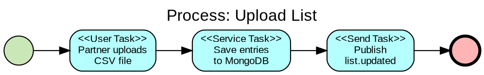
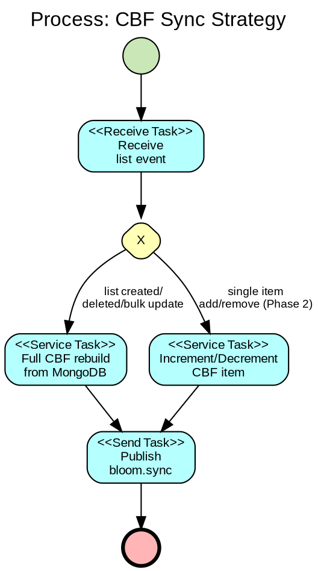
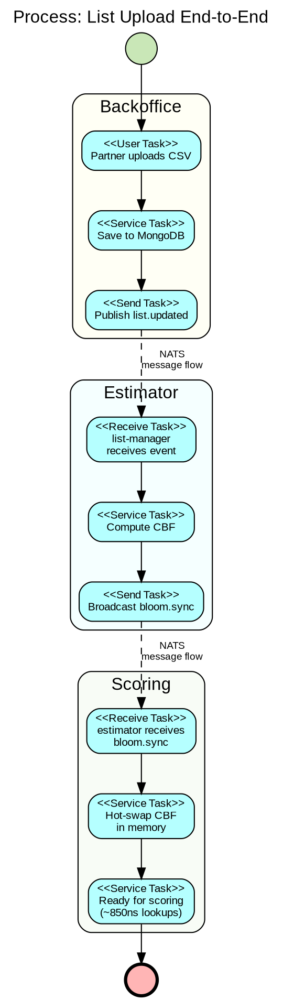
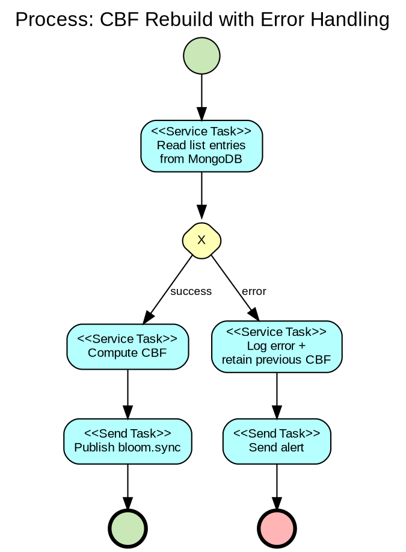

# BPMN Reference

**Source**: Business Process Model and Notation (BPMN) 2.0 Specification (OMG)
**Purpose**: Offline instruction for modeling business processes in initiative documentation. Adapted for Graphviz DOT rendering.

---

## When to Use BPMN

Use BPMN when you need to document **business processes** — workflows that involve multiple actors, decisions, events, and handoffs. BPMN is the standard notation that both technical and business stakeholders can read.

**Use in initiatives when**:
- A business process spans multiple departments or systems (order fulfillment, incident response, list management)
- You need to show who does what and in what order
- The process has complex branching, parallel paths, or error handling
- Stakeholders outside engineering need to understand the flow
- Arc42 Section 6 (Runtime View) or TOGAF Section 2 (Business Architecture) requires process documentation

**Don't use BPMN when**:
- The flow is purely technical (service-to-service calls) — use UML Sequence Diagram instead
- The flow is trivial (linear, no branching) — use ASCII inline
- You're modeling data, not process — use UML Class or ER diagrams

---

## Core Elements

### Flow Objects (the nodes)

| Element | Symbol | Description | DOT Shape |
|---------|--------|-------------|-----------|
| **Task** | Rounded rectangle | A unit of work performed by a participant | `shape=box style="filled,rounded"` |
| **Sub-process** | Rounded rectangle with `+` marker | Collapsed group of tasks | `shape=box style="filled,rounded"` + label with `[+]` |
| **Event** (start) | Thin circle ○ | Triggers the process | `shape=circle width=0.4 style=filled fillcolor=white` |
| **Event** (intermediate) | Double circle ◎ | Something happens during the process | `shape=doublecircle width=0.4` |
| **Event** (end) | Thick circle ● | Process terminates | `shape=circle width=0.4 style=filled fillcolor=black penwidth=3` |
| **Gateway** (exclusive) | Diamond with X | XOR — exactly one path taken | `shape=diamond` with `X` label |
| **Gateway** (parallel) | Diamond with + | AND — all paths taken simultaneously | `shape=diamond` with `+` label |
| **Gateway** (inclusive) | Diamond with O | OR — one or more paths taken | `shape=diamond` with `O` label |
| **Gateway** (event-based) | Diamond with pentagon | Wait for one of several events | `shape=diamond` with `⬠` label |

### Connecting Objects (the edges)

| Element | Style | Description |
|---------|-------|-------------|
| **Sequence Flow** | Solid arrow → | Order of activities within a pool |
| **Message Flow** | Dashed arrow → | Communication between pools (different organizations/systems) |
| **Association** | Dotted line | Links artifacts (data objects, annotations) to flow objects |

### Swimlanes (the containers)

| Element | Description | DOT Equivalent |
|---------|-------------|---------------|
| **Pool** | Represents a participant (organization, system, major actor) | `subgraph cluster_<name>` |
| **Lane** | Subdivision within a pool (role, department, service) | Nested `subgraph cluster_<name>` or visual grouping |

### Artifacts (supplementary info)

| Element | Description |
|---------|-------------|
| **Data Object** | Information consumed or produced (document, message) |
| **Data Store** | Persistent storage (database, file system) |
| **Annotation** | Free-text comment attached to an element |
| **Group** | Visual grouping of elements for documentation purposes |

---

## Event Types (Detail)

Events are the most nuanced BPMN elements. Key types:

### Start Events (what triggers the process)

| Type | Symbol | Description | Example |
|------|--------|-------------|---------|
| None | ○ | Unspecified trigger | "Process begins" |
| Message | ○ with envelope | Triggered by receiving a message | "Receive order request" |
| Timer | ○ with clock | Triggered by time condition | "Every day at 00:00" |
| Signal | ○ with triangle | Triggered by broadcast signal | "System alert received" |
| Conditional | ○ with lines | Triggered when condition becomes true | "Stock drops below threshold" |

### Intermediate Events (what happens during the process)

| Type | Symbol | Description | Example |
|------|--------|-------------|---------|
| Message (catch) | ◎ with envelope | Wait for a message | "Wait for payment confirmation" |
| Message (throw) | ◎ with filled envelope | Send a message | "Notify partner" |
| Timer | ◎ with clock | Wait for time duration/date | "Wait 24 hours" |
| Error (catch) | ◎ with lightning | Catch error from sub-process | "Handle payment failure" |
| Signal (throw) | ◎ with filled triangle | Broadcast signal | "Announce completion" |

### End Events (how the process terminates)

| Type | Symbol | Description | Example |
|------|--------|-------------|---------|
| None | ● | Normal completion | "Process complete" |
| Message | ● with envelope | Ends by sending a message | "Send confirmation email" |
| Error | ● with lightning | Ends with error | "Process failed" |
| Terminate | ● with X | Immediately stops all activities | "Abort all" |

---

## Gateway Patterns

### Exclusive Gateway (XOR) — Choose ONE path

```
        [condition A]
       /              \
  --> <X> -----------> [Task A]
       \              /
        [condition B]
         \           /
          [Task B] --
```

Use when: exactly one condition is true. Default flow for "else" case.

### Parallel Gateway (AND) — ALL paths simultaneously

```
       +--> [Task A] --+
       |                |
  --> <+>              <+> -->
       |                |
       +--> [Task B] --+
```

Use when: multiple activities must happen concurrently. The closing gateway waits for ALL paths to complete.

### Inclusive Gateway (OR) — ONE or MORE paths

```
       +--> [Task A] --+
       |                |
  --> <O>              <O> -->
       |                |
       +--> [Task B] --+
```

Use when: multiple conditions can be true simultaneously. The closing gateway waits for all taken paths.

### Event-Based Gateway — Wait for FIRST event

```
       +--> (Message received) --> [Handle message]
       |
  --> <⬠>
       |
       +--> (Timer expired) --> [Handle timeout]
```

Use when: the process waits for one of several possible events. First event wins.

---

## Task Types

| Type | Marker | Description | Example |
|------|--------|-------------|---------|
| **User Task** | Person icon | Performed by a human | "Review uploaded list" |
| **Service Task** | Gear icon | Automated by software | "Compute CBF from MongoDB" |
| **Script Task** | Script icon | Executed as a script | "Run migration script" |
| **Send Task** | Envelope (black) | Sends a message | "Publish NATS event" |
| **Receive Task** | Envelope (white) | Waits for a message | "Wait for bloom.sync" |
| **Manual Task** | Hand icon | Physical activity outside system | "Verify data in dashboard" |
| **Business Rule Task** | Table icon | Decision table evaluation | "Apply scoring policy" |

In DOT, represent task types with labels: `[label="<<Service Task>>\nCompute CBF"]`

---

## DOT Templates

### Simple Linear Process



### Process with Exclusive Gateway



### Process with Parallel Gateway and Swimlanes



### Process with Error Handling



---

## BPMN vs UML Activity Diagram

| Aspect | BPMN | UML Activity |
|--------|------|-------------|
| **Audience** | Business + technical stakeholders | Primarily technical |
| **Swimlanes** | Pools (organizations) + Lanes (roles) | Partitions |
| **Events** | Rich event taxonomy (message, timer, signal, error, etc.) | Start/end nodes only |
| **Gateways** | XOR, AND, OR, Event-based (explicit symbols) | Decision + fork/join (generic) |
| **Message flow** | Dashed arrows between pools (cross-org communication) | Not native |
| **Standardization** | ISO 19510 standard, widely adopted | UML spec, part of larger standard |
| **Best for** | Cross-functional business processes | Technical algorithms and workflows |

**Rule of thumb**: If the process involves **multiple organizations or departments** communicating via messages, use BPMN. If it's a **single-service algorithm with decisions and loops**, use UML Activity.

---

## Modeling Best Practices

1. **One pool per participant** (system, organization, major actor). Don't mix responsibilities in a single pool.
2. **Start simple** -- model the happy path first, then add error paths and edge cases.
3. **Name tasks with verb + noun** -- "Upload CSV", "Compute CBF", "Send notification". Not "CSV" or "Processing".
4. **Every gateway must have a matching closing gateway** for parallel and inclusive gateways. Exclusive gateways may converge implicitly.
5. **Label all sequence flows from gateways** with the condition. The default flow (else) should be marked.
6. **Use message flows (dashed) between pools**, sequence flows (solid) within a pool. Never mix them.
7. **Keep it on one page** -- if the diagram is too complex, decompose into sub-processes.
8. **Avoid crossing lines** -- rearrange layout if edges cross.
9. **Use intermediate events for waiting** -- a timer event is clearer than a "wait" task.
10. **Don't over-detail** -- BPMN shows the flow, not the implementation. Leave technical details to UML or code.

---

## File Convention

All BPMN diagrams follow the initiative `images/` convention:

1. Write DOT source: `images/bpmn_<process_name>.dot`
2. Compile: `dot -Tpng images/bpmn_<process_name>.dot -o images/bpmn_<process_name>.png`
3. Embed in docs: ``
