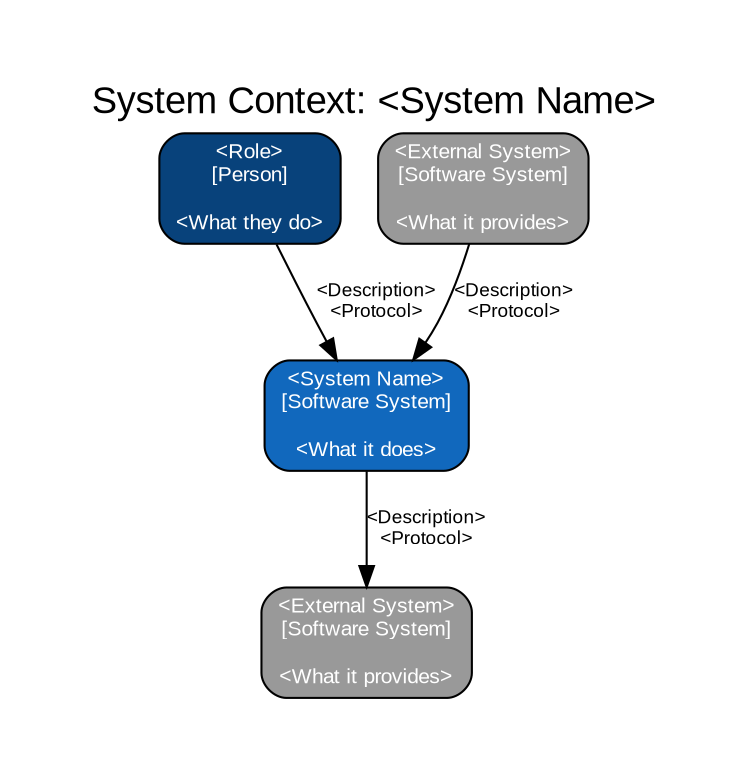
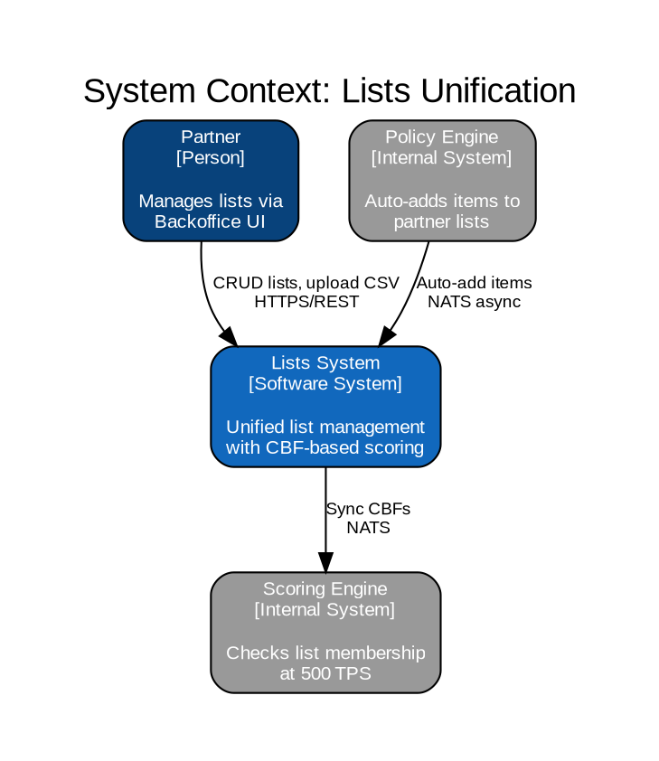
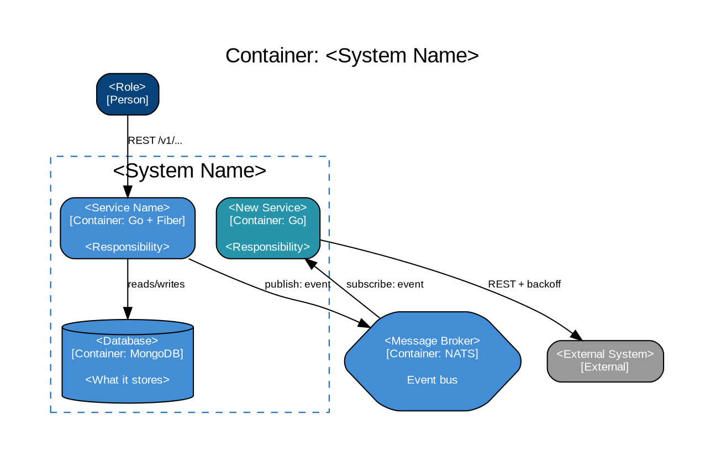
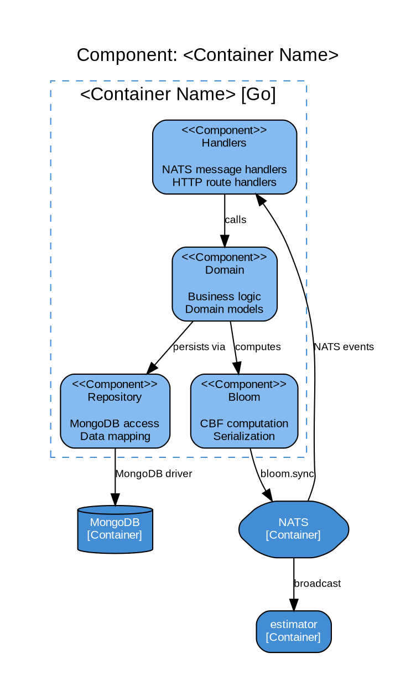
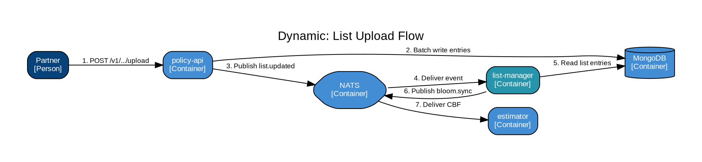
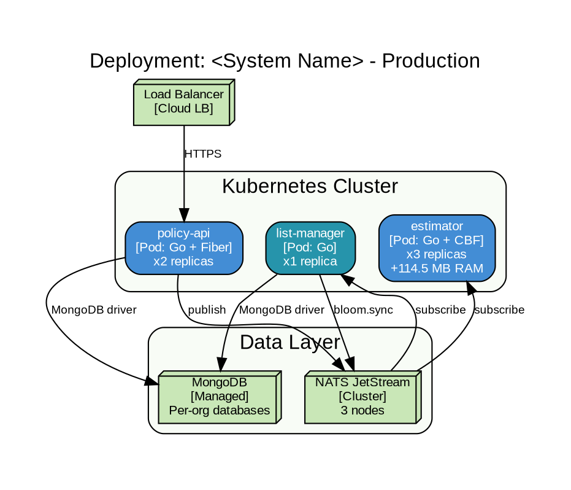

# C4 Model Reference

**Source**: [c4model.com](https://c4model.com) by Simon Brown
**Purpose**: Offline instruction for creating C4 architecture diagrams in initiative documentation. Adapted for Graphviz DOT rendering.

---

## What is C4

C4 is a hierarchical set of software architecture diagrams at four levels of zoom. Think of it like Google Maps — you start zoomed out (context) and progressively zoom in (containers, components, code).

C4 answers four questions:
1. **Context** — What is the system and who uses it?
2. **Container** — What are the major technical building blocks?
3. **Component** — What are the internal parts of each container?
4. **Code** — What does the code look like? (rarely needed)

**Core principle**: Each diagram has a clear audience and purpose. Don't mix levels.

---

## When to Use C4

| Diagram | When | Use in Initiatives |
|---------|------|-------------------|
| **Level 1: Context** | Every initiative | AIC (Business Context), Arc42 §3.1, TOGAF §1.4 |
| **Level 2: Container** | Every initiative with multiple services | AIC (Architectural Hypotheses), Arc42 §5 Level 1, TSC (Architecture Representation) |
| **Level 3: Component** | Complex services that need internal decomposition | Arc42 §5 Level 2, when a single container has multiple internal modules |
| **Level 4: Code** | Rarely — only for critical algorithms or domain models | Arc42 §5 Level 3, or use UML Class Diagram instead |

---

## Level 1: System Context Diagram

### Purpose

Shows **the system** as a single box in the center, surrounded by its **users** (people) and **other systems** it interacts with. The big picture. Answers: "What are we building and who/what interacts with it?"

### Audience

Everyone — technical and non-technical stakeholders, new team members, external partners.

### Elements

| Element | Shape | Color | Description |
|---------|-------|-------|-------------|
| **Person** | Box (rounded) | `#08427B` (dark blue) | A human user of the system |
| **Software System** (yours) | Box (rounded) | `#1168BD` (blue) | The system being documented |
| **Software System** (external) | Box (rounded) | `#999999` (grey) | External systems your system depends on or is used by |
| **Relationship** | Arrow with label | — | Describes the interaction (verb + protocol if relevant) |

### Rules

- Your system is ONE box in the center. No internal structure shown.
- Every actor and external system that communicates with your system must appear.
- Label all relationships with what the interaction IS (not how it works technically).
- Keep it simple — 5-10 boxes maximum.
- Include the protocol only if it matters at this level (REST, NATS, HTTPS).

### DOT Template



### Example: Lists Unification



---

## Level 2: Container Diagram

### Purpose

Zooms into **your system** and shows the **containers** (deployable units) inside it: services, databases, message brokers, file storage, web apps. Answers: "What are the major technical building blocks and how do they communicate?"

### Audience

Technical stakeholders — developers, architects, DevOps.

### Elements

| Element | Shape | Color | Description |
|---------|-------|-------|-------------|
| **Person** | Box (rounded) | `#08427B` (dark blue) | Same as Level 1 |
| **Container** (your system) | Box (rounded) | `#438DD5` (medium blue) | A deployable/runnable unit: service, database, message broker, app |
| **Container** (new/highlighted) | Box (rounded) | `#2694AB` (teal) | A new container being introduced by this initiative |
| **Software System** (external) | Box (rounded) | `#999999` (grey) | External systems (same as Level 1) |
| **System Boundary** | Dashed cluster | `#1168BD` (blue border) | Groups containers that belong to the same system/repo |
| **Database** | Cylinder | `#438DD5` (medium blue) | Persistent data store |
| **Message Broker** | Hexagon | `#438DD5` (medium blue) | Async messaging infrastructure |
| **Relationship** | Arrow with label | — | Protocol + what is transferred |

### Rules

- Each container is a **separately deployable/runnable unit**: a Go binary, a database, a message broker, a queue, a file store.
- Show the **technology** in each container label: `[Container: Go + Fiber]`, `[Container: MongoDB]`, `[Container: NATS JetStream]`.
- Label relationships with **protocol AND what is transferred**: `"REST /v1/lists"`, `"NATS: bloom.sync"`, `"MongoDB driver: read/write"`.
- Use **dashed clusters** to group containers by system boundary (repo, deployment unit).
- Keep people and external systems from Level 1 for context.
- 10-15 containers maximum per diagram. If more, split by subsystem.

### DOT Template



---

## Level 3: Component Diagram

### Purpose

Zooms into **a single container** and shows its internal **components** — logical groupings of related code (packages, modules, layers). Answers: "How is this container structured internally?"

### Audience

Developers working on that specific container.

### Elements

| Element | Shape | Color | Description |
|---------|-------|-------|-------------|
| **Component** | Box (rounded) | `#85BBF0` (light blue) | A logical grouping: Go package, module, layer |
| **Container** (parent) | Dashed cluster | `#438DD5` (blue border) | The container being zoomed into |
| **Container** (sibling) | Box (rounded) | `#438DD5` (medium blue) | Other containers this one interacts with |
| **Relationship** | Arrow with label | — | Method calls, imports, NATS subjects |

### Rules

- Show ONE container's internals per diagram.
- Map components to **Go packages**: `internal/<service>/handlers/`, `internal/<service>/domain/`, `internal/<service>/repo/`.
- Follow MDCA conventions from Go Server.md: handlers -> domain -> repositories.
- Only show components that are architecturally significant. Don't map every single package.
- Include sibling containers and databases that this container interacts with.

### DOT Template



### Go Package Mapping

For Go services following the Go Server.md MDCA structure:

| C4 Component | Go Package | Responsibility |
|-------------|-----------|----------------|
| Handlers | `internal/<svc>/handlers/` | HTTP handlers, NATS message handlers, gRPC handlers |
| Domain | `internal/<svc>/domain/` or `internal/<svc>/models/` | Business logic, domain types, validation |
| Repository | `internal/<svc>/repo/` | Database access, data mapping |
| Ports | `internal/<svc>/ports/` | Interfaces (contracts) for external dependencies |
| DTO | `internal/<svc>/dto/` | Request/response types for API boundaries |
| Config | `internal/<svc>/config/` or `config.go` | Service configuration (env vars) |

---

## Level 4: Code Diagram

### Purpose

Zooms into **a single component** and shows the code-level structure: structs, interfaces, functions, relationships.

### When to Use

**Rarely.** Only for:
- Critical domain models that are hard to understand from code alone
- Complex algorithm structures
- Onboarding documentation for core modules

**In most cases, the code IS the documentation at this level.** Use UML Class Diagrams (see source/UML.md) if you need this level.

---

## Supplementary Diagrams

C4 also defines three supplementary diagrams that are not part of the core hierarchy:

### System Landscape Diagram

**Purpose**: Shows ALL systems in the enterprise and how they relate. A "zoomed out" Level 1 covering the entire organization.

**When**: Enterprise architecture overview. Multiple systems being documented. TOGAF Architecture Vision.

**Elements**: Same as Level 1, but multiple "your systems" (all blue, not just one).

### Dynamic Diagram

**Purpose**: Shows how containers/components interact for a specific use case (like a UML Sequence Diagram, but using C4 elements).

**When**: Arc42 §6 (Runtime View). Use when you want to show a scenario using C4 notation instead of sequence diagrams.

**Elements**: Same as Level 2 or 3, but with numbered arrows showing the order of interactions.



### Deployment Diagram

**Purpose**: Maps containers to infrastructure nodes. Shows WHERE containers run. Equivalent to UML Deployment Diagram.

**When**: Arc42 §7 (Deployment View). Infrastructure documentation. Capacity planning.

**Elements**:

| Element | Shape | Color | Description |
|---------|-------|-------|-------------|
| **Deployment Node** | 3D box or cluster | `#C9E7B7` (green) | Physical/virtual host, K8s node, cloud region |
| **Infrastructure Node** | 3D box | `#C9E7B7` (green) | Database server, message broker node, CDN |
| **Container Instance** | Box (rounded) | `#438DD5` (blue) | Running instance of a container |



---

## Color Scheme Summary

| Element | Hex | Usage |
|---------|-----|-------|
| Person | `#08427B` | Dark blue, white text |
| Your System / Container | `#1168BD` / `#438DD5` | Blue family, white text |
| New Container | `#2694AB` | Teal, white text — highlights new additions |
| Component | `#85BBF0` | Light blue, black text |
| External System | `#999999` | Grey, white text |
| Deprecated | `#FFB5B5` | Red-tinted, black text |
| Infrastructure Node | `#C9E7B7` | Green (matches ArchiMate Technology layer) |
| System Boundary | `#1168BD` border | Dashed cluster outline |

---

## Diagram Selection Decision Tree

```
What level of detail?
  |
  +-- Big picture (what is the system?) -----------> Level 1: Context
  |
  +-- Technical building blocks (what runs?) ------> Level 2: Container
  |
  +-- Internal structure of one service? ----------> Level 3: Component
  |
  +-- Code-level types and interfaces? ------------> Level 4: Code (or UML Class)
  |
  +-- All systems in the enterprise? --------------> System Landscape
  |
  +-- Runtime scenario with numbered steps? -------> Dynamic Diagram
  |
  +-- Where does it run (K8s, cloud, nodes)? ------> Deployment Diagram
```

---

## C4 vs Other Notations

| Need | C4 | Alternative |
|------|-----|------------|
| System-in-context | Level 1: Context | ArchiMate motivation view |
| Service decomposition | Level 2: Container | UML Component Diagram |
| Internal package structure | Level 3: Component | UML Package Diagram |
| Code structure | Level 4: Code | UML Class Diagram (see source/UML.md) |
| Runtime interactions | Dynamic Diagram | UML Sequence Diagram (see source/UML.md) |
| Infrastructure mapping | Deployment Diagram | UML Deployment or ArchiMate Technology (see source/TOGAF.md) |
| Business processes | Not covered by C4 | BPMN (see source/BPMN.md) |
| Enterprise architecture | System Landscape | ArchiMate layered view (see source/TOGAF.md) |

---

## File Convention

All C4 diagrams follow the initiative `images/` convention:

1. Write DOT source: `images/c4_<level>_<name>.dot`
2. Compile: `dot -Tpng images/c4_<level>_<name>.dot -o images/c4_<level>_<name>.png`
3. Embed in docs: ``

**Naming examples**:
- `images/c4_context.dot` / `.png` — Level 1
- `images/c4_container.dot` / `.png` — Level 2
- `images/c4_component_list_manager.dot` / `.png` — Level 3 for list-manager
- `images/c4_dynamic_upload.dot` / `.png` — Dynamic: upload flow
- `images/c4_deployment_prod.dot` / `.png` — Deployment: production
- `images/c4_landscape.dot` / `.png` — System Landscape
