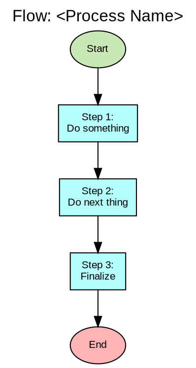
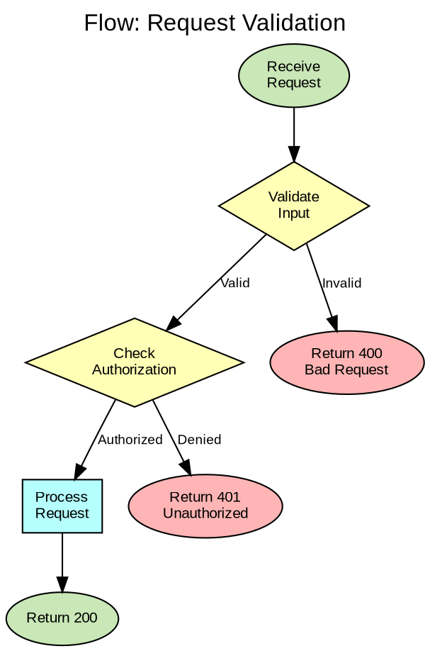
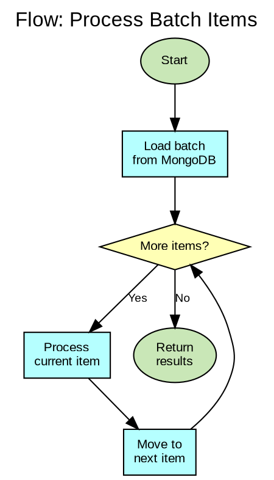
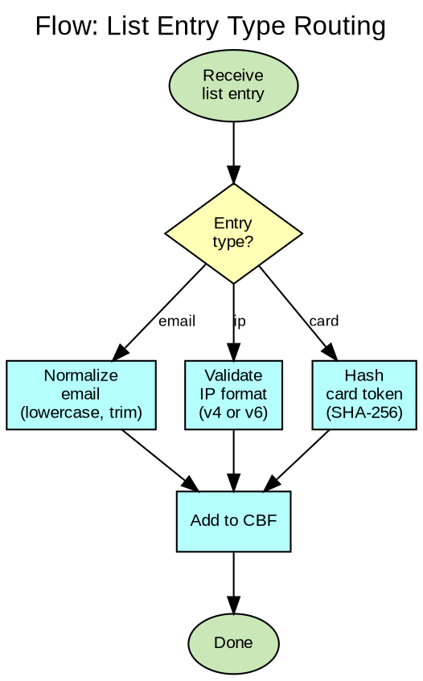
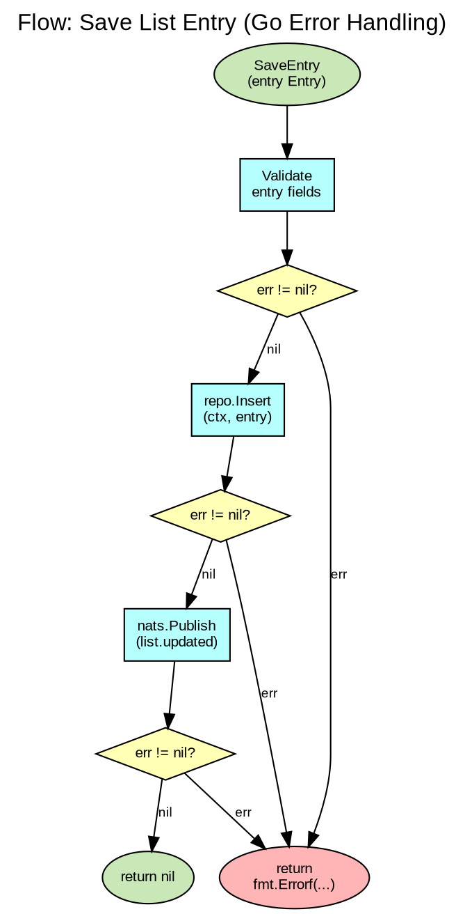
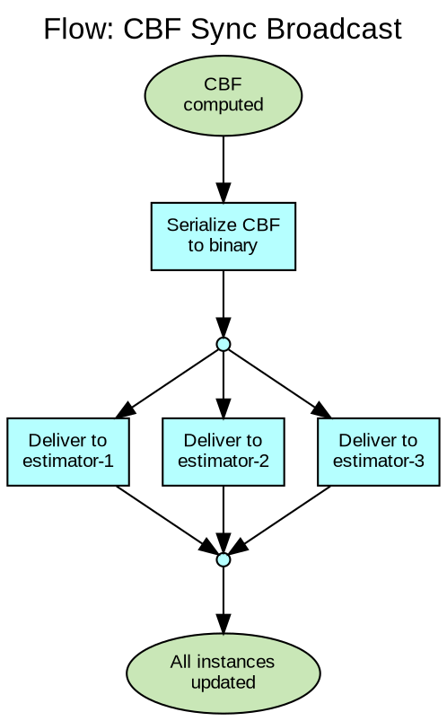

# Flowchart Reference

**Source**: ISO 5807:1985 (Information processing — Documentation symbols and conventions for data, program and system flowcharts)
**Purpose**: Offline instruction for creating flowcharts in initiative documentation. Adapted for Graphviz DOT rendering.

---

## What is a Flowchart

A flowchart is a diagram that represents a process, algorithm, or workflow as a sequence of steps connected by arrows. It is the simplest and most universally understood diagram type — readable by anyone without specialized notation training.

Flowcharts predate UML, BPMN, and C4. They remain the best choice when:
- The audience includes non-technical stakeholders
- The process is algorithmic (step-by-step with decisions)
- No formal notation is needed — just clarity

---

## When to Use

| Situation | Use Flowchart? | Or Use Instead |
|-----------|---------------|----------------|
| Simple algorithm or decision logic | Yes | — |
| Data validation flow | Yes | — |
| Troubleshooting / debugging guide | Yes | — |
| Onboarding: "how does X work?" | Yes | — |
| Business process with multiple actors/departments | No | BPMN (see source/BPMN.md) |
| Service-to-service interaction over time | No | UML Sequence (see source/UML.md) |
| Entity lifecycle with named states | No | UML State Machine (see source/UML.md) |
| System decomposition | No | C4 (see source/C4.md) |

**Rule of thumb**: If the flow has ONE actor executing steps with decisions, use a flowchart. If it has MULTIPLE actors exchanging messages, use BPMN or Sequence Diagram.

---

## Standard Symbols

| Symbol | Shape | Meaning | DOT Shape |
|--------|-------|---------|-----------|
| **Terminal** | Rounded rectangle / oval | Start or End of the flow | `shape=oval` or `shape=box style="filled,rounded"` |
| **Process** | Rectangle | An action or operation | `shape=box` |
| **Decision** | Diamond | Yes/No or conditional branch | `shape=diamond` |
| **Input/Output** | Parallelogram | Data input or output | `shape=parallelogram` |
| **Document** | Rectangle with wavy bottom | A document produced or consumed | `shape=note` |
| **Data Store** | Open rectangle / cylinder | Database or persistent storage | `shape=cylinder` |
| **Predefined Process** | Rectangle with double side borders | A subroutine or function call defined elsewhere | `shape=box style="filled,rounded" peripheries=2` |
| **Connector** | Small circle | Jump point (continues on another part of the chart) | `shape=circle width=0.3` |
| **Flow Arrow** | Arrow | Direction of flow | Edge `->` |
| **Annotation** | Open rectangle with dashed border | Comment or note | `shape=plaintext` or `shape=note style=dashed` |

---

## Flow Direction

| Direction | When to Use | DOT Setting |
|-----------|------------|-------------|
| **Top to Bottom** (TB) | Default. Best for most flowcharts. | `rankdir=TB` |
| **Left to Right** (LR) | Wide flows with few branches. Horizontal processes. | `rankdir=LR` |

**Rule**: Pick one direction and stick to it. Never mix horizontal and vertical flow in the same chart.

---

## Decision Patterns

### Binary Decision (Yes/No)

The most common pattern. One diamond, two outgoing edges labeled "Yes" and "No".

```
         [Check condition]
              /    \
          Yes/      \No
            /        \
    [Do something] [Do other thing]
```

### Multi-Way Decision

A single decision point with more than two outcomes. Use when selecting among 3+ options.

```
         [Evaluate type]
          /    |    \
      email   ip    card
        /      |      \
    [...]   [...]   [...]
```

### Loop (While / For)

A decision that loops back to an earlier step.

```
    [Initialize]
         |
         v
    [Check condition] --No--> [Exit]
         |
        Yes
         |
    [Process item]
         |
    [Advance counter]
         |
         +---(loop back to Check)
```

### Guard Pattern (Early Return)

Sequential checks that exit early on failure. Common in Go error handling.

```
    [Receive request]
         |
    [Valid input?] --No--> [Return 400]
         |
        Yes
         |
    [Authorized?] --No--> [Return 401]
         |
        Yes
         |
    [Process request]
         |
    [Return 200]
```

---

## DOT Templates

### Simple Linear Flow



### Decision Flow



### Loop Flow



### Multi-Way Decision



### Error Handling Flow (Go Pattern)



### Parallel / Fork-Join Flow



---

## Color Scheme

Consistent with other diagram notations in this workspace:

| Element | Color | Hex | Usage |
|---------|-------|-----|-------|
| Start / Success | Pale green | `#C9E7B7` | Entry points, successful outcomes |
| Process step | Pale cyan | `#B5FFFF` | Normal processing steps |
| Decision | Pale yellow | `#FFFFB5` | Decision diamonds |
| Error / End (failure) | Pale red | `#FFB5B5` | Error states, failure exits |
| Data store | Pale cyan | `#B5FFFF` | Database, file storage |
| Annotation | White | `#FFFFFF` | Comments, notes |

---

## Best Practices

1. **One entry, one primary exit**. A flowchart should have one Start and ideally one End (error exits are acceptable as additional terminals).
2. **Top to bottom, left to right**. Flow should follow natural reading direction.
3. **Label every decision edge**. "Yes"/"No", or the specific condition. Never leave decision edges unlabeled.
4. **Keep it on one page**. If the flowchart doesn't fit, decompose into sub-processes (use Predefined Process symbol to reference sub-flowcharts).
5. **Verb + noun for process steps**. "Validate input", "Compute CBF", "Publish event". Not "Validation" or "CBF".
6. **Avoid crossing lines**. Rearrange the layout. If edges must cross, it's a sign the flow is too complex — decompose.
7. **Max 15-20 nodes**. Beyond that, the flowchart loses readability. Split into multiple flowcharts.
8. **Consistent shapes**. Always use diamond for decisions, rectangle for processes. Don't use rectangles for both.
9. **Default path downward**. The happy path should flow straight down. Exceptions and errors branch to the side.
10. **Don't duplicate what code already says**. A flowchart documents the LOGIC, not the implementation. `Validate input` is enough — don't list every field.

---

## Flowchart vs Other Notations

| Need | Flowchart | Better Alternative |
|------|-----------|-------------------|
| Simple algorithm with decisions | Best choice | — |
| Go function error handling flow | Good choice | — |
| Data pipeline steps | Good choice | — |
| Multi-actor business process | Weak | BPMN (source/BPMN.md) |
| Service-to-service interaction | Weak | UML Sequence (source/UML.md) |
| Object lifecycle (states) | Wrong tool | UML State Machine (source/UML.md) |
| System architecture overview | Wrong tool | C4 (source/C4.md) |
| Complex workflow with events, timers, signals | Wrong tool | BPMN (source/BPMN.md) |

---

## File Convention

All flowcharts follow the initiative `images/` convention:

1. Write DOT source: `images/flow_<name>.dot`
2. Compile: `dot -Tpng images/flow_<name>.dot -o images/flow_<name>.png`
3. Embed in docs: ``

**Naming examples**:
- `images/flow_request_validation.dot` / `.png`
- `images/flow_cbf_rebuild.dot` / `.png`
- `images/flow_list_entry_routing.dot` / `.png`
- `images/flow_migration_procedure.dot` / `.png`
- `images/flow_error_handling.dot` / `.png`
