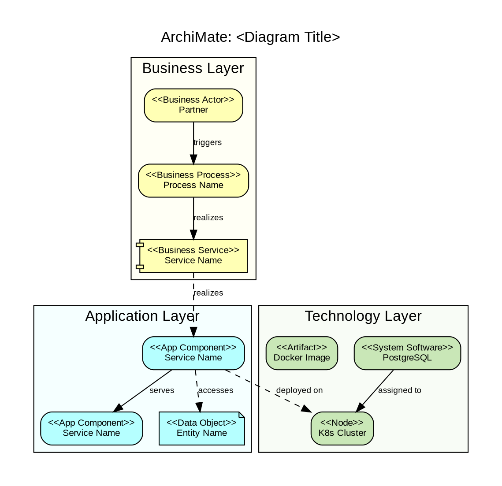

# TOGAF ADM & ArchiMate Instruction

**Source**: TOGAF Standard (The Open Group), ArchiMate 3.2 Specification
**Purpose**: Offline instruction for generating TOGAF Architecture Development Method documentation with ArchiMate diagrams. No internet connection required.

---

## When to Use

Generate `togaf.md` ONLY when explicitly requested, or recommend it when:
- Enterprise-wide or cross-domain initiative (multiple business units affected)
- Migration from legacy systems with multiple phases
- Compliance-heavy systems (SOC2, PCI-DSS, GDPR-critical)
- When arc42 feels insufficient for the organizational scope
- When stakeholders require formal enterprise architecture artifacts

---

## TOGAF ADM Phases

The Architecture Development Method is an iterative cycle with 8 phases:

```
                    Preliminary
                        |
                        v
              +---> Architecture Vision (Phase A)
              |         |
              |         v
              |    Business Architecture (Phase B)
              |         |
              |         v
              |    Information Systems Architecture (Phase C)
              |    (Data + Application)
              |         |
              |         v
              |    Technology Architecture (Phase D)
              |         |
              |         v
              |    Opportunities & Solutions (Phase E)
              |         |
              |         v
              |    Migration Planning (Phase F)
              |         |
              |         v
              |    Implementation Governance (Phase G)
              |         |
              |         v
              +--- Architecture Change Management (Phase H)

              Requirements Management (center, continuous)
```

---

## Document Structure (8 Sections)

### 1. Architecture Vision (Phase A)

Define the problem, stakeholders, principles, and scope.

#### 1.1 Problem Statement
Clear description of the business problem or opportunity driving this architecture work.

#### 1.2 Stakeholders and Concerns

| Stakeholder | Role | Key Concerns |
|:------------|:-----|:-------------|
| *role* | *what they do* | *what they care about architecturally* |

#### 1.3 Architecture Principles

| # | Principle | Rationale | Implications |
|:--|:----------|:----------|:-------------|
| 1 | *principle name* | *why this matters* | *what this forces/enables* |

Reference Engineering Principles (POL-ENG-001) for technology principles. Add initiative-specific principles here.

#### 1.4 Vision Summary
1-2 paragraph narrative of the target state. Include a high-level ArchiMate motivation diagram if helpful.

#### 1.5 Scope

| Dimension | In Scope | Out of Scope |
|:----------|:---------|:-------------|
| Business processes | ... | ... |
| Applications/services | ... | ... |
| Data domains | ... | ... |
| Technology platforms | ... | ... |

---

### 2. Business Architecture (Phase B)

Model the business layer: capabilities, processes, services, actors.

#### 2.1 Business Capability Map
Table of capabilities with description and supporting systems.

#### 2.2 Business Processes
For each key process:
- Trigger, Actors, Outcome
- Process flow diagram (BPMN or ASCII)

#### 2.3 ArchiMate Business Layer Diagram

Use DOT with ArchiMate notation. **Color: `#FFFFB5`** (pale yellow) for all business elements.

**ArchiMate Business Elements**:

| Element | Notation | Description |
|---------|----------|-------------|
| Business Actor | `<<Business Actor>>` | Person or organization |
| Business Role | `<<Business Role>>` | Responsibility assigned to an actor |
| Business Process | `<<Business Process>>` | Sequence of business behaviors |
| Business Service | `<<Business Service>>` | Externally visible business behavior |
| Business Object | `<<Business Object>>` | Passive element (data, document) |
| Business Event | `<<Business Event>>` | Something that happens and triggers behavior |

**ArchiMate Relationships**:

| Relationship | Meaning | Arrow |
|-------------|---------|-------|
| Composition | "is part of" | Filled diamond |
| Aggregation | "groups" | Open diamond |
| Assignment | "performs / is allocated to" | Filled circle -> |
| Realization | "realizes" | Dashed open arrow |
| Serving | "serves / used by" | Open arrow |
| Triggering | "triggers" | Filled arrow |
| Flow | "transfers" | Dashed filled arrow |
| Access | "reads/writes" | Dashed arrow |

---

### 3. Information Systems Architecture (Phase C)

Two sub-architectures:

#### 3.1 Application Architecture

Model the application layer. **Color: `#B5FFFF`** (pale cyan) for all application elements.

**ArchiMate Application Elements**:

| Element | Notation | Description |
|---------|----------|-------------|
| Application Component | `<<App Component>>` | Modular, deployable unit of software |
| Application Service | `<<App Service>>` | Externally visible application behavior |
| Application Interface | `<<App Interface>>` | Access point (API endpoint, UI) |
| Application Function | `<<App Function>>` | Internal behavior element |
| Application Event | `<<App Event>>` | Application-level event |
| Application Process | `<<App Process>>` | Sequence of application behaviors |

**What to document**:
- C4 Container diagram adapted to ArchiMate notation
- Service inventory: name, responsibility, APIs, events produced/consumed
- Integration patterns: NATS subjects (per Engineering Principles), REST endpoints

#### 3.2 Data Architecture

- Data entities and their relationships (ER diagram or ArchiMate data objects)
- Data flow between services
- Storage technology mapping (which service uses which DB)
- Data ownership: which service is the source of truth for which entity

**ArchiMate Data Elements**:

| Element | Notation | Description |
|---------|----------|-------------|
| Data Object | `<<Data Object>>` | Passive element used by application components |

---

### 4. Technology Architecture (Phase D)

Model the technology/infrastructure layer. **Color: `#C9E7B7`** (pale green) for all technology elements.

**ArchiMate Technology Elements**:

| Element | Notation | Description |
|---------|----------|-------------|
| Node | `<<Node>>` | Computational resource (server, VM, container) |
| Device | `<<Device>>` | Physical hardware |
| System Software | `<<System Software>>` | Software platform (OS, DB engine, runtime) |
| Technology Service | `<<Tech Service>>` | Externally visible infra behavior (DNS, LB) |
| Artifact | `<<Artifact>>` | Physical piece of data (binary, config file, image) |
| Communication Network | `<<Network>>` | Communication medium (VPN, VPC, internet) |
| Technology Interface | `<<Tech Interface>>` | Access point on technology layer (port, socket) |
| Technology Process | `<<Tech Process>>` | Sequence of technology behaviors |
| Technology Event | `<<Tech Event>>` | Technology-level event |

**What to document**:
- Deployment diagram: K8s cluster layout, database nodes, message broker, CDN
- Network topology: VPCs, security groups, ingress/egress
- Infrastructure as Code references
- Align with Twelve-Factor App factors VII (Port Binding), IX (Disposability), X (Dev/Prod Parity)

---

### 5. Opportunities and Solutions (Phase E)

Gap analysis between current (baseline) and target architectures.

#### 5.1 Gap Analysis

| Component | Baseline | Target | Gap | Action |
|-----------|----------|--------|-----|--------|
| *name* | *current state* | *desired state* | *what's missing* | *build / buy / reuse / migrate* |

#### 5.2 Solution Building Blocks

Map gaps to concrete deliverables:
- New services to build
- Existing services to modify
- Infrastructure to provision
- Data migrations to execute

---

### 6. Migration Planning (Phase F)

Define implementation phases using the Genesis -> Custom -> Product model from Policy of Initiatives (POL-TECH-001).

#### 6.1 Transition Architectures

| Phase | Name | Scope | Duration | Deliverables |
|-------|------|-------|----------|-------------|
| Genesis | *name* | PoC + core foundation | *estimate* | *what ships* |
| Custom | *name* | MVP production-grade | *estimate* | *what ships* |
| Product | *name* | Full feature set | *estimate* | *what ships* |

#### 6.2 Migration Dependency Diagram

Show dependencies between migration work packages. Which must complete before others can start.

---

### 7. Implementation Governance (Phase G)

#### 7.1 Architecture Compliance

| Principle | Compliance Check | Status |
|-----------|-----------------|--------|
| Performance by Design | Benchmark results for hot paths | Pending |
| KISS | Code review checklist item | Active |
| Event-Driven | All internal comms via NATS | Active |

#### 7.2 Decision Log

| ID | Decision | Date | Rationale | Status |
|----|----------|------|-----------|--------|
| ADR-001 | *decision* | *date* | *why* | Accepted / Superseded |

#### 7.3 Risk Register

| # | Risk | Probability | Impact | Mitigation | Owner |
|---|------|-------------|--------|------------|-------|
| 1 | *description* | H/M/L | H/M/L | *action* | *role* |

---

### 8. Architecture Change Management (Phase H)

#### 8.1 Change Triggers
What events would trigger re-architecture:
- Business model change
- 10x scale requirement
- New compliance regulation
- Technology end-of-life

#### 8.2 Change Process
How architecture changes flow: proposal -> AIC -> review -> approval -> implementation.
Reference Policy of Initiatives (POL-TECH-001) stages.

#### 8.3 Technical Debt Register

| # | Debt Item | Impact | Priority | Remediation Plan |
|---|-----------|--------|----------|-----------------|
| 1 | *description* | *effect on quality* | H/M/L | *plan* |

---

## ArchiMate Diagram Conventions

### Color Scheme

| Layer | Color | Hex |
|-------|-------|-----|
| Business | Pale yellow | `#FFFFB5` |
| Application | Pale cyan | `#B5FFFF` |
| Technology | Pale green | `#C9E7B7` |
| Motivation | White | `#FFFFFF` |
| Strategy | Light pink | `#F5DEDC` |

### DOT Template



### Render Command

All diagrams go in `images/` inside the initiative folder, in dual format (`.dot` source + `.png` compiled):

```bash
dot -Tpng images/<name>.dot -o images/<name>.png
```

Embed in documents: ``

---

## Relationship to Other Documents

| TOGAF Section | Maps to AIC Field | Maps to Arc42 Section |
|--------------|-------------------|----------------------|
| 1. Architecture Vision | Business Case + Quality Goals | 1. Introduction & Goals |
| 2. Business Architecture | Business Context | 3.1 Business Context |
| 3. IS Architecture | Architectural Hypotheses | 5. Building Block View |
| 4. Technology Architecture | (Technical Constraints) | 7. Deployment View |
| 5. Opportunities & Solutions | Technical Challenges & Risks | 11. Risks & Tech Debt |
| 6. Migration Planning | Tasks (Genesis/Custom/Product) | - |
| 7. Implementation Governance | - | 9. Architecture Decisions |
| 8. Change Management | - | - |
