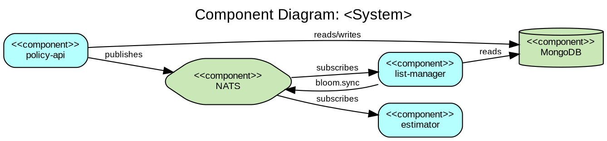
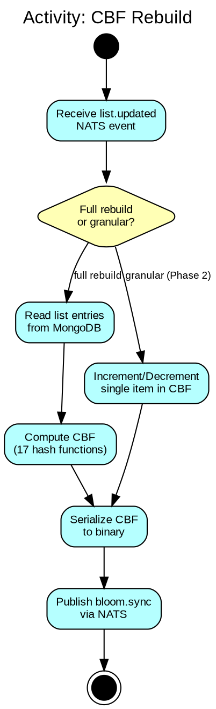
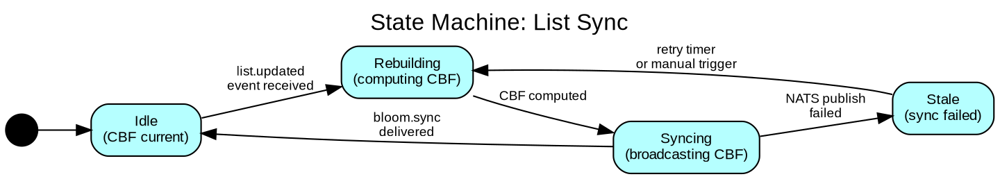
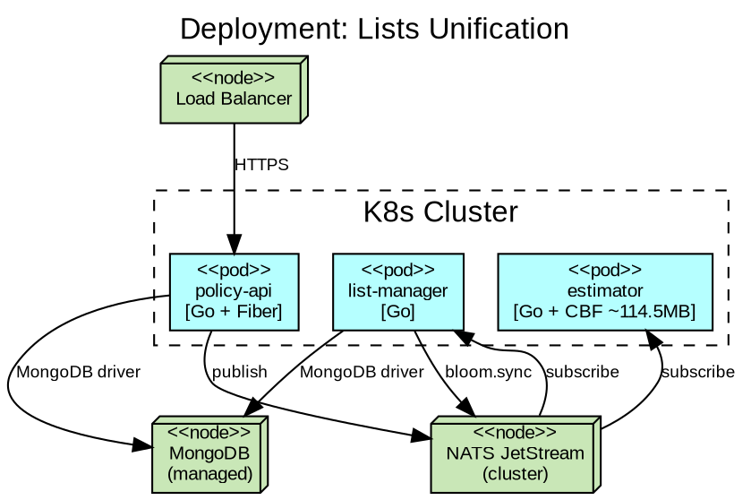
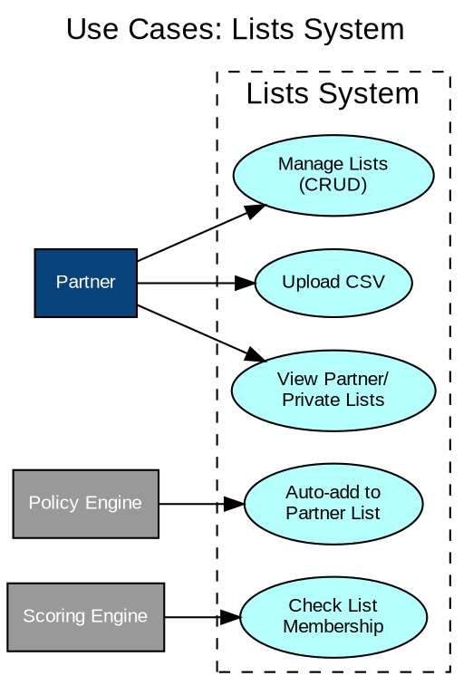

# UML Diagram Reference

**Source**: Unified Modeling Language (UML) 2.5.1 Specification (OMG)
**Purpose**: Offline instruction for choosing and drawing UML diagrams in initiative documentation. Adapted for Graphviz DOT rendering.

---

## When to Use UML

UML diagrams supplement architecture documents (aic.md, arc42.md, tsc.md, togaf.md) when C4 or ArchiMate notation is insufficient for the level of detail needed. Use UML when you need to show:

- Internal behavior of a component (sequence, activity, state)
- Class/struct relationships within a service
- Deployment topology at infrastructure level
- Use cases for stakeholder communication

**Rule**: Don't draw every diagram type. Pick only the ones that communicate something the reader cannot understand from the text alone.

---

## Diagram Types Overview

UML has 14 diagram types in two categories:

### Structure Diagrams (static, what exists)

| Diagram | Purpose | When to Use in Initiatives |
|---------|---------|---------------------------|
| **Class** | Types, attributes, methods, relationships | Domain model in arc42 Section 8. Package/struct relationships in Go. |
| **Component** | High-level module decomposition | Arc42 Section 5 (Building Block View). Alternative to C4 Container. |
| **Deployment** | Physical/infrastructure mapping | Arc42 Section 7 (Deployment View). K8s nodes, databases, networks. |
| **Package** | Grouping of elements | Go package dependencies. Monorepo structure visualization. |
| **Object** | Instance-level snapshot | Rarely needed. Use for debugging or data flow examples. |
| **Composite Structure** | Internal structure of a class/component | Rarely needed. Use Component instead. |
| **Profile** | Stereotype extensions | Not applicable for our use. |

### Behavior Diagrams (dynamic, what happens)

| Diagram | Purpose | When to Use in Initiatives |
|---------|---------|---------------------------|
| **Sequence** | Object interactions over time | Arc42 Section 6 (Runtime View). API call flows. NATS message flows. |
| **Activity** | Workflow / algorithm flow | Business processes. Data pipeline steps. Migration procedures. |
| **State Machine** | Lifecycle of an entity | Order states, payment states, list sync states. |
| **Use Case** | Actor-system interactions | Stakeholder communication. Requirements overview in arc42 Section 1. |
| **Communication** | Object interactions (spatial) | Alternative to sequence when topology matters more than order. |
| **Interaction Overview** | High-level flow of interactions | Complex scenarios combining multiple sequence diagrams. Rarely needed. |
| **Timing** | Time-constrained interactions | Real-time systems. SLA visualization. Rarely needed. |

---

## Most Used Diagrams (Priority Order)

### 1. Sequence Diagram

**When**: Show how components interact in a specific scenario. Best for API flows, NATS message chains, request/response patterns.

**Use in**: Arc42 Section 6 (Runtime View), AIC key flows, TSC sequence flow.

**Elements**:

| Element | Symbol | Description |
|---------|--------|-------------|
| Lifeline | Vertical dashed line | Represents a participant (service, actor, database) |
| Activation | Rectangle on lifeline | Period when participant is processing |
| Synchronous message | Solid arrow → | Call that waits for response |
| Asynchronous message | Open arrow → | Fire-and-forget (NATS async) |
| Return message | Dashed arrow ← | Response to a synchronous call |
| Self-message | Arrow to self | Internal processing |
| Alt fragment | `[alt]` box | If/else branching |
| Loop fragment | `[loop]` box | Repeated behavior |
| Opt fragment | `[opt]` box | Optional behavior |
| Note | Rectangle with folded corner | Explanation |

**DOT rendering**: Sequence diagrams are difficult in Graphviz. **Prefer ASCII art** inline in documents for sequences:

```
Partner        policy-api       MongoDB        NATS         list-manager
  |                |               |             |              |
  |--POST list---->|               |             |              |
  |                |--save-------->|             |              |
  |                |--publish----->|------------>|              |
  |                |               |             |--deliver---->|
  |                |               |             |              |--process
  |<--200 OK-------|               |             |              |
```

**Convention for ASCII sequences**:
- Participants across the top, separated by enough space
- `--label-->` for synchronous calls
- `--label->` (single `>`) for async / fire-and-forget
- `<--label--` for responses
- Vertical `|` for idle lifelines
- Indent self-processing below the participant

---

### 2. Component Diagram

**When**: Show high-level module decomposition, provided interfaces, required interfaces, and dependencies between components.

**Use in**: Arc42 Section 5 (Building Block View). Alternative/complement to C4 Container diagram.

**Elements**:

| Element | Symbol | Description |
|---------|--------|-------------|
| Component | Box with `<<component>>` or small component icon | A modular unit (service, package, library) |
| Provided interface | Lollipop (circle on stick) | Interface this component exposes |
| Required interface | Socket (half-circle) | Interface this component needs |
| Port | Small square on component border | Connection point |
| Dependency | Dashed arrow → | "depends on" |
| Realization | Dashed arrow with open head → | "implements" |

**DOT template**:



---

### 3. Activity Diagram

**When**: Show workflow, algorithm, or business process as a flow of activities with decisions and parallel branches. More detailed than BPMN for technical flows.

**Use in**: Arc42 Section 6 (complex algorithms), migration procedures, data pipeline steps.

**Elements**:

| Element | Symbol | Description |
|---------|--------|-------------|
| Initial node | Filled circle ● | Start of flow |
| Final node | Filled circle in circle ◉ | End of flow |
| Action | Rounded rectangle | A step/activity |
| Decision | Diamond ◇ | Branch point (guard conditions on edges) |
| Merge | Diamond ◇ | Rejoin after decision |
| Fork | Thick horizontal bar | Split into parallel flows |
| Join | Thick horizontal bar | Synchronize parallel flows |
| Swimlane | Vertical/horizontal partition | Responsibility assignment |

**DOT template** (vertical flow):



---

### 4. State Machine Diagram

**When**: Show the lifecycle of an entity — all valid states and transitions between them.

**Use in**: Entity lifecycle documentation (order states, payment states, list sync states). Arc42 Section 8 (cross-cutting concepts).

**Elements**:

| Element | Symbol | Description |
|---------|--------|-------------|
| State | Rounded rectangle | A condition the entity is in |
| Initial state | Filled circle ● | Starting state |
| Final state | Filled circle in circle ◉ | Terminal state |
| Transition | Arrow → | State change, labeled with trigger `[guard] / action` |
| Composite state | Nested rounded rectangle | State containing sub-states |
| Choice | Diamond ◇ | Dynamic conditional branch |

**DOT template**:



---

### 5. Deployment Diagram

**When**: Show infrastructure topology — nodes, devices, execution environments, and how artifacts map to them.

**Use in**: Arc42 Section 7 (Deployment View). Shows K8s clusters, database nodes, network zones.

**Elements**:

| Element | Symbol | Description |
|---------|--------|-------------|
| Node | 3D box | Physical or virtual machine, container, K8s pod |
| Execution environment | Node with `<<execution environment>>` | Runtime (JVM, container, K8s namespace) |
| Artifact | Rectangle with `<<artifact>>` | Deployable unit (Docker image, binary, config) |
| Communication path | Line between nodes | Network connection (label with protocol) |
| Deployment | Dashed arrow | Artifact deployed to node |

**DOT template**:



---

### 6. Use Case Diagram

**When**: Show what actors can do with the system at a high level. Best for stakeholder communication and requirements overview.

**Use in**: Arc42 Section 1 (Requirements Overview). AIC functional overview.

**Elements**:

| Element | Symbol | Description |
|---------|--------|-------------|
| Actor | Stick figure or box with `<<actor>>` | External user or system |
| Use case | Ellipse | A capability the system provides |
| System boundary | Rectangle around use cases | Scope of the system |
| Association | Line | Actor participates in use case |
| Include | Dashed arrow with `<<include>>` | Use case always includes another |
| Extend | Dashed arrow with `<<extend>>` | Use case optionally extends another |
| Generalization | Arrow with open head | Inheritance between actors or use cases |

**DOT template**:



---

### 7. Class Diagram (Go Adaptation)

**When**: Show struct/interface relationships in the domain model. Go has no classes — use structs, interfaces, and composition.

**Use in**: Arc42 Section 8 (domain model), Go Server.md domain layer documentation.

**Go-specific mapping**:

| UML Concept | Go Equivalent |
|-------------|---------------|
| Class | `struct` |
| Interface | `interface` |
| Inheritance | Embedding (composition) |
| Association | Field reference (`*OtherStruct`) |
| Dependency | Import / function parameter |
| Method | Receiver function |
| Abstract class | Interface + unexported base struct |
| Visibility: public | Exported (capitalized) |
| Visibility: private | Unexported (lowercase) |

**DOT template**:

```dot
digraph ClassDiagram {
    graph [label="Domain Model: List" labelloc=t fontsize=16 fontname="Arial" rankdir=TB]
    node [shape=record style=filled fillcolor="#B5FFFF" fontname="Courier" fontsize=9]
    edge [fontname="Arial" fontsize=9]

    List [label="{<<struct>>\nList|+ ID : string\n+ OrgSlug : string\n+ Kind : ListKind\n+ Name : string\n+ Summary : string\n+ CreatedAt : time.Time|+ Validate() error}"]

    Entry [label="{<<struct>>\nEntry|+ ID : string\n+ ListID : string\n+ Type : string\n+ Value : string\n+ CreatedAt : time.Time|}"]

    Repository [label="{<<interface>>\nRepository|+ Save(List) error\n+ Get(id string) (List, error)\n+ ListEntries(listID, cursor, limit) ([]Entry, error)\n+ AddEntry(Entry) error\n+ RemoveEntry(listID, value) error}" fillcolor="#FFFFB5"]

    List -> Entry [label="1..*" arrowhead=diamond]
    Repository -> List [label="manages" style=dashed]
    Repository -> Entry [label="manages" style=dashed]
}
```

---

## Diagram Selection Guide

Use this decision tree when choosing which diagram to draw:

```
What do you need to show?
  |
  +-- System structure (what exists)
  |     |
  |     +-- High-level services/modules? --> C4 Container or Component Diagram
  |     +-- Infrastructure/deployment? --> Deployment Diagram
  |     +-- Domain types and relationships? --> Class Diagram
  |     +-- Package dependencies? --> Package Diagram (or simple DOT graph)
  |
  +-- System behavior (what happens)
  |     |
  |     +-- How components interact in a scenario? --> Sequence Diagram (ASCII)
  |     +-- Workflow with decisions and parallel paths? --> Activity Diagram
  |     +-- Entity lifecycle (states and transitions)? --> State Machine Diagram
  |     +-- What actors can do? --> Use Case Diagram
  |     +-- Business process with roles and events? --> BPMN (see source/BPMN.md)
  |
  +-- Both structure and behavior? --> C4 Context + Sequence for key flows
```

---

## File Convention

All diagrams follow the initiative `images/` convention:

1. Write DOT source: `images/<type>_<name>.dot`
2. Compile: `dot -Tpng images/<type>_<name>.dot -o images/<type>_<name>.png`
3. Embed in docs: ``

**Naming examples**:
- `images/component_lists.dot` / `.png`
- `images/sequence_upload.dot` / `.png` (or ASCII inline)
- `images/state_list_sync.dot` / `.png`
- `images/deployment_k8s.dot` / `.png`
- `images/usecase_lists.dot` / `.png`
- `images/class_domain.dot` / `.png`
- `images/activity_cbf_rebuild.dot` / `.png`
